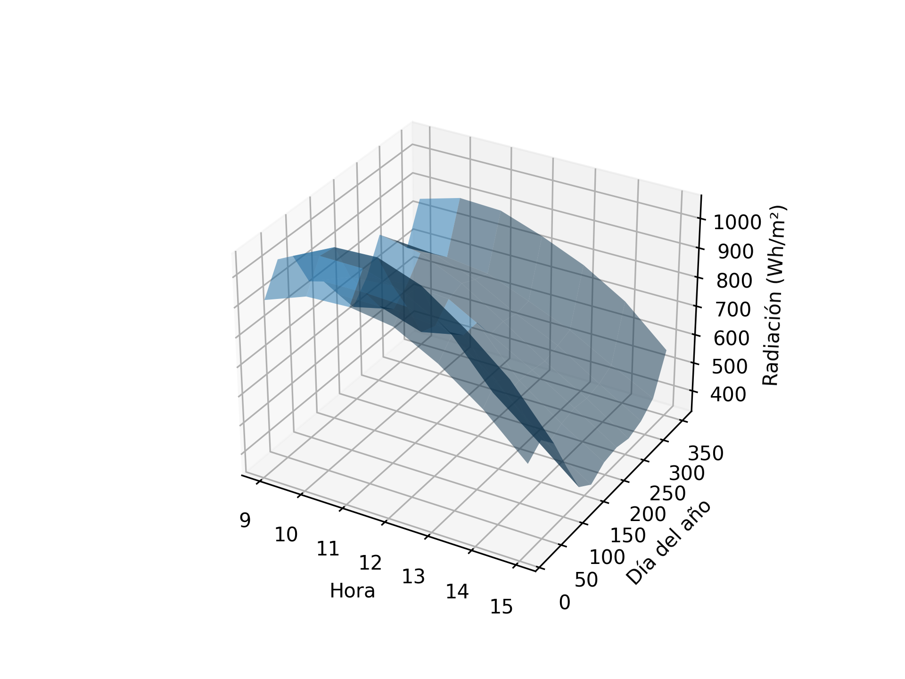

# Solar Distillation Model (Python)

This project models solar radiation and heat transfer in a solar distillation system using Python.

## Features

* Hourly solar radiation calculation
* Seasonal variation (12 months)
* Heat transfer modeling (convection, radiation, evaporation)
* Water distillation estimation
* 3D visualization of results

## Technologies

* Python
* NumPy
* Matplotlib

## Results

### Solar Radiation

### Heat Available

### Water Production

## How to run

pip install -r requirements.txt
python solar_distillation.py

## Author

Catalina Barquero
Mechanical Engineer
